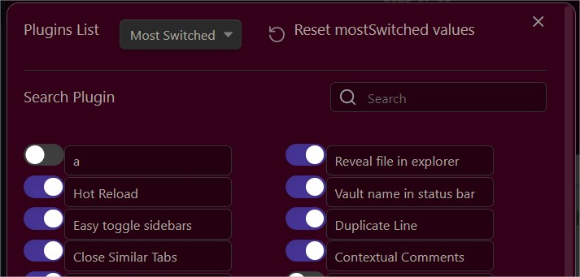
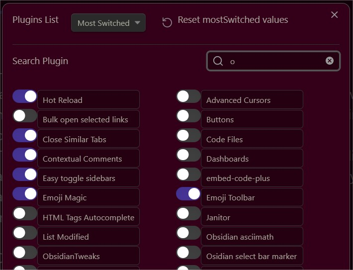

## Quick Plugin Switcher

To quickly switch between plugins directly from the ribbon bar.  
Filterable and Searchable item list. 
Most Switched filter option prioritizes plugins you switch most often by placing them at the top.
You can reset this filter.  
  
This plugin simplifies the process of managing your plugins, making it easy to enable or disable them based on your needs.
  

    

