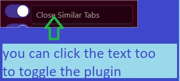
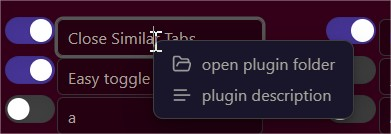

## Quick Plugin Switcher

This plugin simplifies the process of managing your plugins    

Quickly switch your plugins directly from the ribbon bar  

## Toggle pluggins

    
## Filterable item list  

- Most Switched filter is useful for most often switched plugins...
- Enabled First to have all enabled plugin on top     

  
## Search tool

tips: if you add a space at the end of your search, it will modify search to "starting with" instead of "including"

## Menus

There is a context menu (right click) on each item:  

In this menu, you can disable and re-enable all plugins

## video

temp
  
