## Quick Plugin Switcher

New: 
- no more needed to click on a plugin before to use shortcuts  
- desktop only are now marked with a ᴰ

This plugin simplifies the process of managing your plugins (demos at the end of this page)

- quickly switch your plugins (ribbon bar icon or command)  
- apply filters to show them  
- search engine
- add plugins to groups
- plugin delayed start
- open plugin in its directory, show description, open github...
  
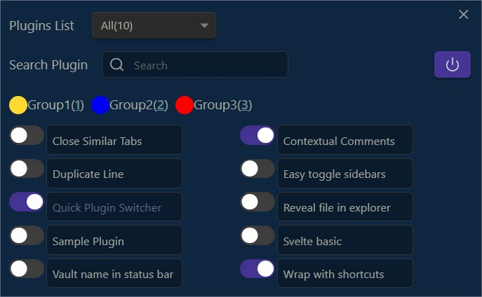

you have now an option in settings to show shortcuts

## Filterable item list    

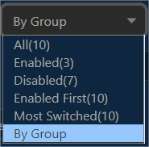 
  
Most Switched filter (most switched plugins)   
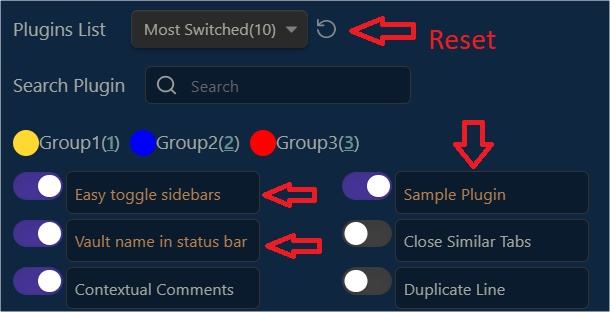
  
By group  
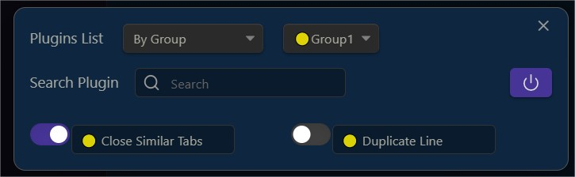
  
  
## Add group to **plugins**

- Add groups to your plugins. Set number of groups in settings

- Toggle plugins by group   
  
1 - Add groups
  - Shorcuts:
    - Over a plugin name, press</b> <kbd>1 to 7 </kbd> to add group, <kbd>0/del/suppr</kbd> to delete.
   
  - Context Menu
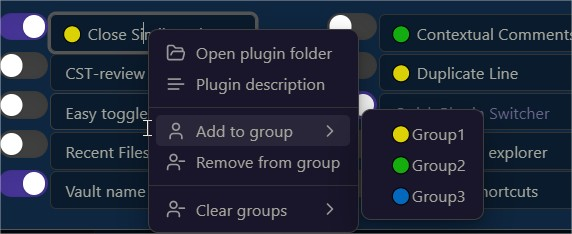

- Several groups(4 max) by plugin. Delete  
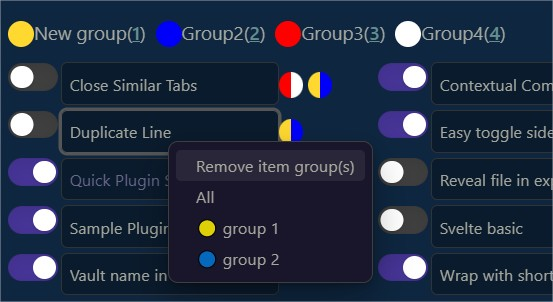 
  
- rename groups (dbl click)
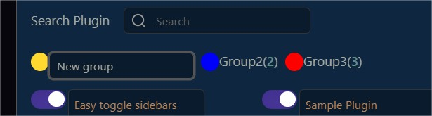
  
2 - Toggle several plugins (disabled plugins are ignored) 
      
- All or by group
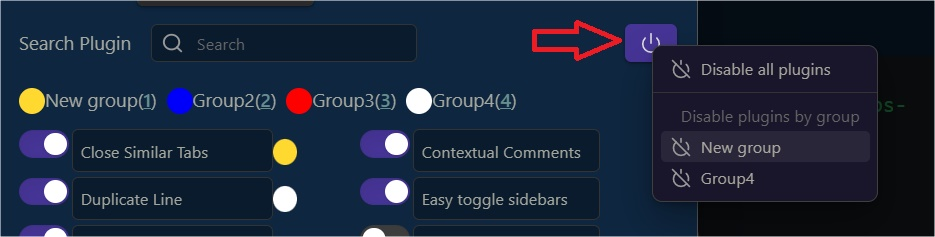

- re-enable plugins or skip it to reset the toggle
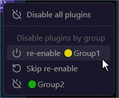  

3 - Enable disable all plugins in a group  
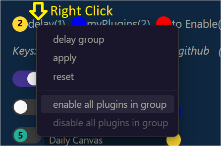  

## Delay plugins at start

- delay each plugin → dbl click
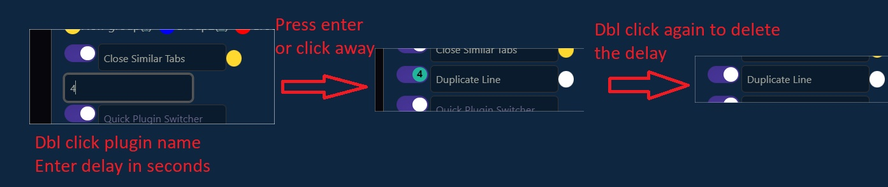  
notice time in the bullet and color

- delay by group
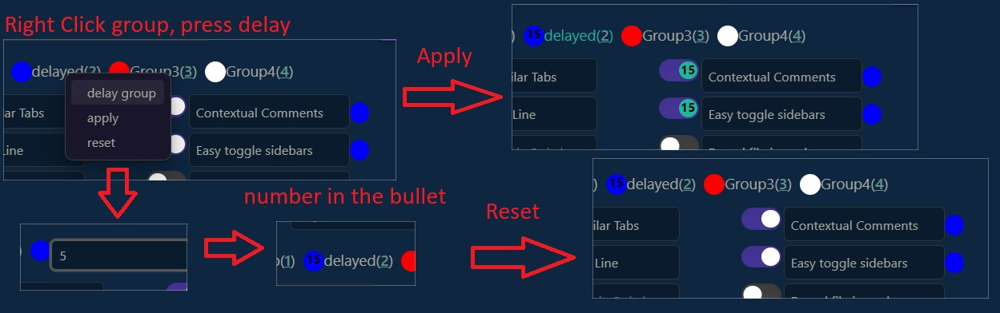
Erase time in the bullet entering 0 or nothing in delay group

## More tools

some shortcuts have been added to this now. activate the option to show shortcuts guide in settings 

**- Open plugin folder
- Open plugin short description
- Open plugin github
- Open Obsidian plugin settings
- Open plugin shortcuts**

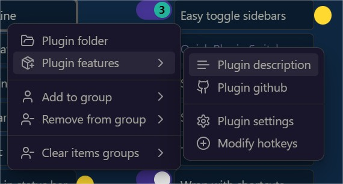

## Search tool

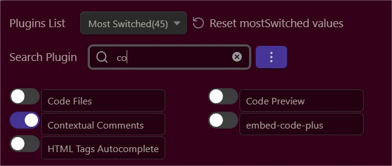
if you add a space at the end of your search, it will modify search to "starting with" (instead of "including")
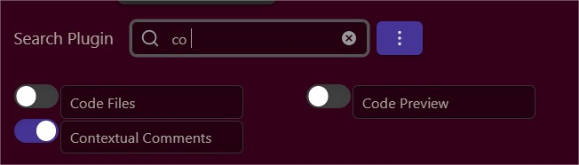

## videos

-4- shortcuts helper

-3- delay at start (feature request, inspired by "plugin groups")

update info will show only once

-2- groups
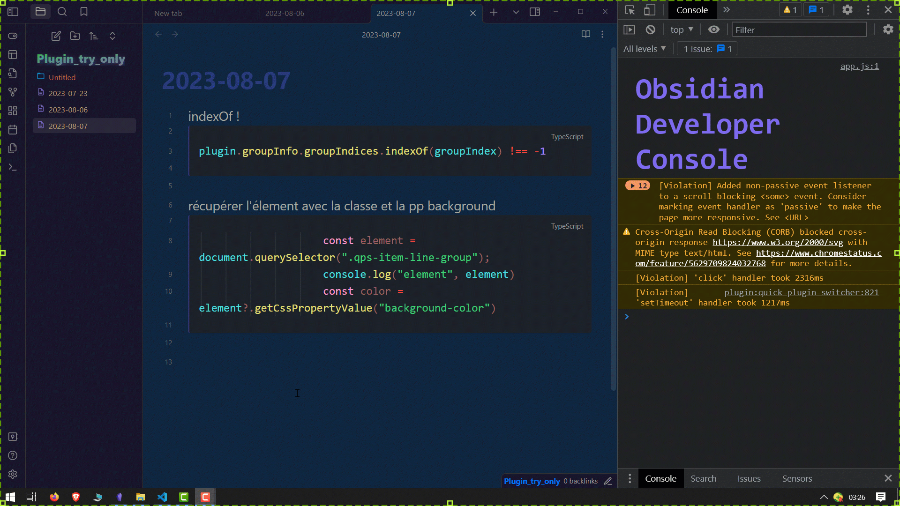

-1- first demo
  
