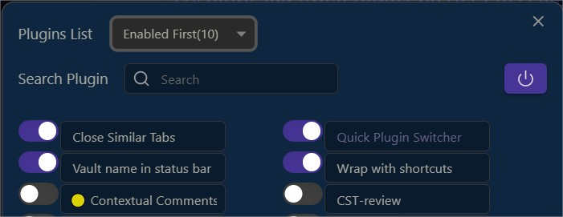

## Quick Plugin Switcher

This plugin simplifies the process of managing your plugins    

- quickly switch your plugins (ribbon bar icon or command)  
- apply filters to show them  
- and search engine

## Filterable item list    

  
Most Switched filter is useful for most often switched plugins...(you can reset this)  

## Add group to plugins

As you can see above, you can add groups to your plugins ( 7 colors )

you can then toggle plugins by group   

1 - Add group
  - using shortcut <kbd>1 to 7</kbd> and <kbd>0/del/suppr</kbd>, over each item
  - using context menu
  
you can see other the possible operations  

- you can add several groups(4 max) by plugin item  
  and then delete them <kbd>0/del/suppr</kbd>
 
- you can now rename groups

2 - you can then toggle plugins  
  
- all or by group   
( group shown if enabled plugin inside)  

- you can re-enable same plugins later
  
you can skip re-enable and reset the toggle, without re-enabling

## Search tool

if you add a space at the end of your search, it will modify search to "starting with" (instead of "including")

## videos

  
